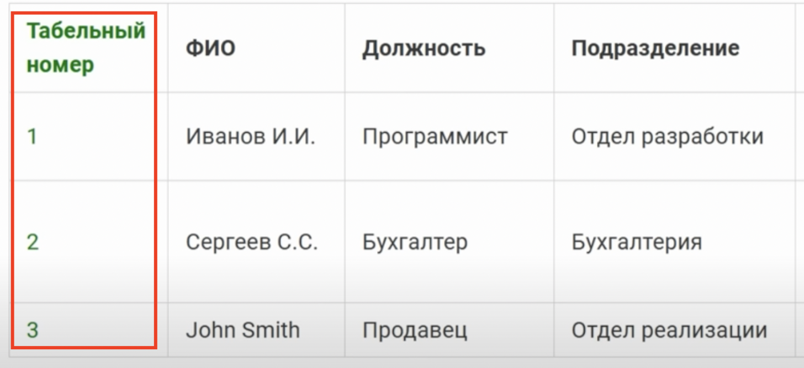

## Подготовка к собесу:

---
##### Вопросы работодателю
- Какой стек 
- Какой проект
- Будет ли выделеный наставник
- Команда какая (Состав, роли, позиции)
- Какие дальше этапы / сроки
- Что по деньгам? (Ну это тебя скорей спросят - придумай вилку свою мин/комф)
- По какому регламенту работают (скрам или нет)
---
##### Задачи от Creative Studio
- Автоматизация  рутины
- Рассылка метрик клиентам
- Использование DBT 
- Трансформация упрощения ETL
- Группировка даyных  
---

##### Подготовить по своему резюме:
- участие в проектировании разработки БД (PosgreSQL) для автоматиции торговли на рынке Forex;
- разработка ETL процессов на Airflow;
- разработке парсеров новостных сайтов(investing.com) на Scrapy, Selenium;
- использование Pandas для трансформации данных полученных из JSON через API брокера.

---
## Вопросы к собесу(теория):
- **Data Lake** - сырые данные, процессом по необходимости. Не зависит от источника. 
- **Data Warehouse** - загружаем данные в единую модель. Сырые данные не хранятся. Подходит если источники не меняют выгружаемые данные иначе тратится много усилий на трансформацию данных для хранения необходимой информации с источников в DWH. 

#### Виды БД:
 - **реляционные табличные** (данные хранятся виде срок)
 - **noSQL** (ключ-значение)
 - **колончатые** (данные хранятся в виде столбцов) 

#### Что в себе хранят БД:
- **Сущности** - таблицы
- **Атрибуты сущностей** - данные в таблице 

#### Виды типов БД:
- **OLTP** - частое добавление/обновление/удаление. 
- **OLAP** - агрегация(суммирование, усреднение, группировка)

#### Перечислите схемы(OLAP) проектирования в ДЕ:

- **Снежинка** - расширенный вид звезды с дополнительными измерениями для более строгой нормализации данных. 
Таблица фактов (Fact table) содержит фактические числовые данные для анализа
имеет связь с
Измерения (Dimensions): Это таблицы, содержащие описательные атрибуты, которые характеризуют данные в таблице фактов. 


- **Звезда** - имеет централизованное хранилище данных, которое хранится в таблице фактов. Схема разбивает таблицу фактов на ряд денормализованных таблиц измерений. Таблица фактов содержит агрегированные данные, которые будут использоваться для составления отчетов, а таблица измерений описывает хранимые данные.
Таблица фактов (Fact table) содержит фактические числовые данные для анализа
имеет связь с
Измерения (Dimensions): Это таблицы, содержащие описательные атрибуты, которые характеризуют данные в таблице фактов. 


- **Data Vault** - состоит из хабов(бизнес сущности), сатилитов(атрибуты(описание) сущностей) и ликов(таблица ссылок для анализа) видов таблиц. 

 
- **Anchor model** - Якорная модель


#### Через что осуществляются связи в таблицах:
- **Первичный ключ** (primary key) 
- **Внешний ключ** (foreign key)


#### Виды нормальных форм таблиц:

- **Первая нормальная форма (1NF):**
В каждой ячейке таблицы должно быть одно и только одно значение.
Каждая колонка в таблице должна иметь уникальное имя.
 

- **Вторая нормальная форма (2NF):**
Таблица должна быть в 1NF.
Таблица должна иметь ключ, по которому можно идентифицировать каждую строку.
 

- **Третья нормальная форма (3NF):**
Таблица должна быть в 2NF.
Не должно быть транзитивных зависимостей: если A зависит от B, а B зависит от C, то A не должно зависеть от C.
Все неключевые атрибуты должны зависеть только от первичного ключа.

Декомпазиция (разделение таблицы)
 

- **Четвёртая нормальная форма (4NF):**
Таблица должна быть в 3NF.
В таблице не должно быть многозначных зависимостей, когда один и тот же ключ имеет несколько связанных значений.


#### В CAP говорится, что в распределенной системе возможно выбрать только 2 из 3-х свойств:
• C (consistency) — согласованность. Каждое чтение даст вам самую последнюю запись.  
• A (availability) — доступность. Каждый узел (не упавший) всегда успешно выполняет запросы (на чтение и запись).  
• P (partition tolerance) — устойчивость к распределению. Даже если между узлами нет связи, они продолжают работать независимо друг от друга.
---


### SQL (теория):


**GROUP BY** - группировка данных(чаще для агрегатных ф-ций COUNT, SUM, AVG, MAX, MIN и т.д.) для отображения отдельных сгруппированных значений для какого-то атрибута. 
```
    SELECT CustomerID, SUM(TotalAmount) AS TotalSales
    FROM Orders
    GROUP BY CustomerID;
```
**HAVING** - применяет условия фильтрации к агрегированным данным, которые были сгруппированы с использованием оператора GROUP BY.
```
    SELECT CustomerID, SUM(TotalAmount) AS TotalSales
    FROM Orders
    GROUP BY CustomerID
    HAVING SUM(TotalAmount) > 1000;
```
**ORDER BY (DESC)** - сортировка данных. 
 
**ROLLUP** - создания итоговых строк на основе группированных данных.  
**WITH ROLLUP** включает NULL значения. 
```
    SELECT Year, Month, SUM(Amount) AS TotalSales
    FROM Sales
    GROUP BY ROLLUP(Year, Month);
```
```
    SELECT Year, Month, SUM(Amount) AS TotalSales
    FROM Sales
    GROUP BY Year, Month WITH ROLLUP;
```
**DISTINCT** - удаление дубликатов из результирующего набора данных

**IN** - фильтрация строк, где значение определенного столбца равно одному из набора значений
```
    SELECT column_name(s)
    FROM table_name
    WHERE column_name IN (value1, value2, ...);
```
**BETWEEN**  - фильтрации данных по диапазону значений. 
```
    SELECT column_name(s)
    FROM table_name
    WHERE column_name BETWEEN value1 AND value2;
```
**INNER JOIN** - вывод совпадений двух таблиц  
**LEFT JOIN** - вывод  всей  первой(левой) таблицы и пересечений с второй(правой) 
**RIGHT JOIN** - вывод всей правой(второй) таблицы и пересечений с первой(первой) 


```
    SELECT o.order_id, c.name
    FROM orders as o
    LEFT JOIN customers as c
    ON o.customer_id = c.customer_id;
```


----


### Python (теория):
- **Неизменяемые типы данных**
```
    Int, str, float, tuple, bool, None …. 
``` 
- **Изменяемые типы дынных**
```
    list, dict, set 
```
- #### Коллекции:
```
    List(список) - изменяемый упорядоченный список. 
    Tuple(кортеж) - неизменяемый упорядоченный список. 
    Set (множество) - это неупорядоченная коллекция уникальных элементов. 
    Dict(словарь) - ключ-значение. 
```

- #### Способы объединения словарей:
```
    dict1.update(dict2)
    dict1 = dict1 | dict2
    merged_dict = {**dict1, **dict2}
```

- #### Контекстный менеджер - with  
    Обеспечивает управление ресурсами с автоматическим освобождением после завершения работы с ресурсами.
```
    with open("file.txt", "r") as file:
        contents = file.read()
        print(contents)
```    
```    
    import psycopg2
    
    # Параметры подключения к базе данных PostgreSQL
    dbname = 'your_database_name'
    user = 'your_username'
    password = 'your_password'
    host = 'your_host'
    port = 'your_port'
    
    # Создание подключения к базе данных с использованием контекстного менеджера
    with psycopg2.connect(dbname=dbname, user=user, password=password, host=host, port=port) as connection:
        # Создание курсора для выполнения SQL-запросов
        with connection.cursor() as cursor:
        
            # Создание таблицы (если она не существует)
            cursor.execute('''CREATE TABLE IF NOT EXISTS users
                              (id SERIAL PRIMARY KEY, name TEXT, age INTEGER)''')
            
            # Вставка данных
            cursor.execute("INSERT INTO users (name, age) VALUES (%s, %s)", ('Alice', 30))
            cursor.execute("INSERT INTO users (name, age) VALUES (%s, %s)", ('Bob', 25))
            
            # Получение данных
            cursor.execute("SELECT * FROM users")
            rows = cursor.fetchall()
            for row in rows:
                print(row)
```

- #### *args  
    Передавать переменное количество позиционных аргументов в функцию. 
```
    def my_function(*args):
        for arg in args:
            print(arg)
    
    my_function(1, 2, 3
    my_function('a', 'b', 'c', 'd')
    my_function(True, False)
```   

- #### **kwargs  
    Для передачи переменного числа именованных аргументов (ключевых аргументов) внутрь функции. 
```
    def my_function(**kwargs):
        for key, value in kwargs.items():
            print(f"{key}: {value}")
    
    my_function(name='Alice', age=30)
    my_function(city='New York', country='USA')
    my_function(is_student=True)
```

- #### try-except 
    Для обработки исключений
```   
    try:
     x = 10 / "а"
    except ZeroDivisionError:
        print("Деление на ноль недопустимо")
    except NameError:
        print("Деление на данный символ не возможно")
    else:
        print("Результат:", x)
    finally:
        print("Этот блок всегда будет выполнен, даже если возникнет исключение")
```

- #### @decorator 
    Декораторы функций - позволяет изменять поведение функций без изменения их исходного кода.
```
    def my_decorator(func):
        def wrapper(*args, **kwargs):
            print("Something is happening before the function is called.")
            result = func(*args, **kwargs)
            print("Something is happening after the function is called.")
            return result
        return wrapper
    
    @my_decorator
    def say_hello(name):
        print(f"Hello, {name}!")
    
    say_hello("John")
```
```
    def make_sentence(func):
        def wrapper(word):
            sentence = func(word)
            return sentence.capitalize() + '.'
        return wrapper
    
    @make_sentence
    def add_hello(word):
        return "hello " + word
    
    print(add_hello("world"))  # Вывод: Hello world.
```

- #### request  
    Позволяет отправлять запросы на веб-серверы, получать данные
```
    import requests
    response = requests.get('https://api.binance.com/api/v3/tickers/price')
    # Проверка успешности запроса
    if response.status_code == 200:
        data = response.json()
        print(data) # получили весь JSON
```
